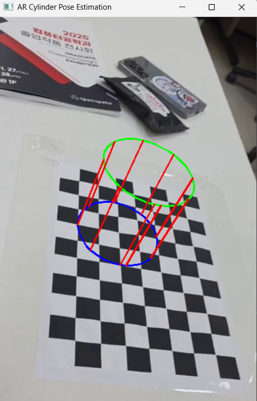

# 🏛️ Cylinder-AR-Navigator

본 프로젝트는 카메라 캘리브레이션 데이터를 기반으로 체스판의 위치와 자세를 추정하고, 지정된 특정 좌표 위에 3D 원기둥(Cylinder)을 실시간으로 증강하는 AR(Augmented Reality) 프로그램입니다.

## 📝 주요 기능 (Mission)
* **Camera Pose Estimation (5점)**: 이전 과제(HW#3)를 통해 획득한 카메라 매트릭스(K)와 왜곡 계수를 활용하여, 실시간 영상 속 체스판의 회전(Rotation) 및 이동(Translation) 정보를 계산합니다.
* **AR Object Visualization (15점)**: 체스판의 특정 격자 좌표 `(5, 4, 0)`를 중심으로 하는 가상의 3D 원기둥을 시각화합니다. 단순한 선 출력을 넘어 `cv2.projectPoints`를 통한 정확한 3D-to-2D 투영을 구현하였습니다.

## 🛠️ 구현 상세
1. **Pose Estimation**: `cv2.findChessboardCorners`로 코너를 탐지하고, `cv2.solvePnP` 알고리즘을 사용하여 카메라 좌표계와 세계 좌표계 사이의 변환 행렬을 구합니다.
2. **Cylinder Rendering**: 
   - 원기둥의 바닥면과 윗면을 구성하는 3D 점들을 생성합니다.
   - 체스판 한 칸의 실제 크기(`board_cellsize`)를 반영하여 `(5, 4)` 위치로 오프셋(Offset)을 적용했습니다.
   - `cv2.polylines`와 `cv2.line`을 사용하여 원기둥의 형태를 렌더링합니다.

## 🚀 실행 방법
### 선행 조건
* Python 3.x
* OpenCV (`opencv-python`)
* NumPy

### 실행
1. `video.mp4` 영상을 준비합니다. (또는 실시간 카메라 연결)
2. `PressingFisheye.py`의 캘리브레이션 로직을 실행하여 K와 `dist_coeffs`를 얻습니다.
3. 메인 스크립트를 실행하여 AR 결과를 확인합니다.

## 🎥 실행 결과
